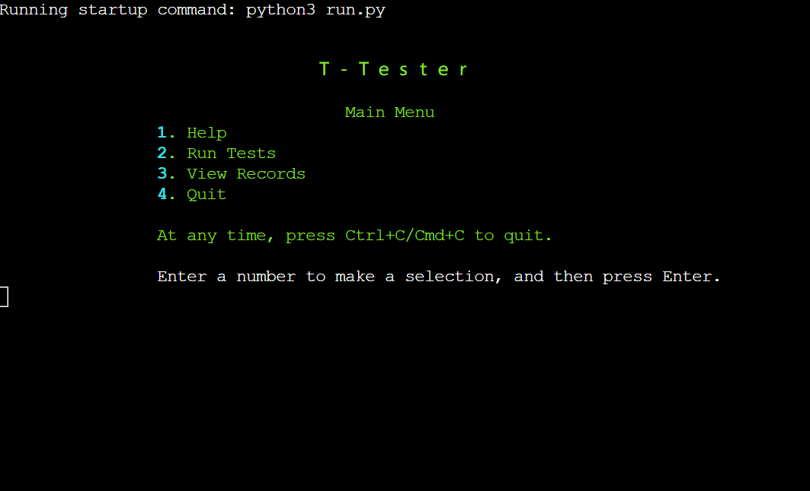
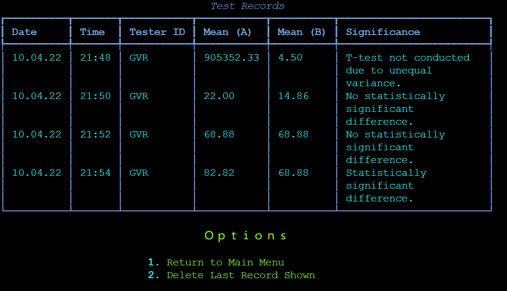
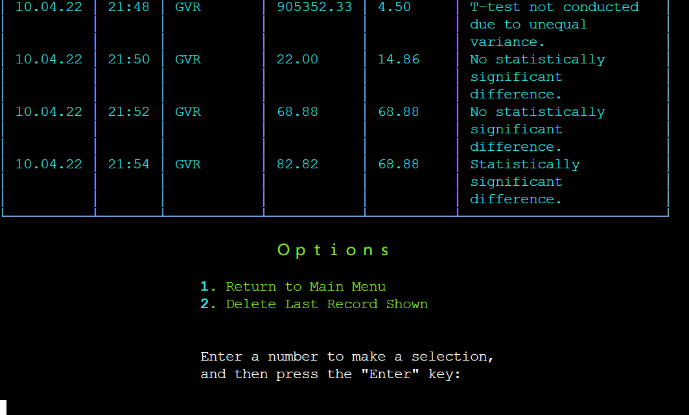
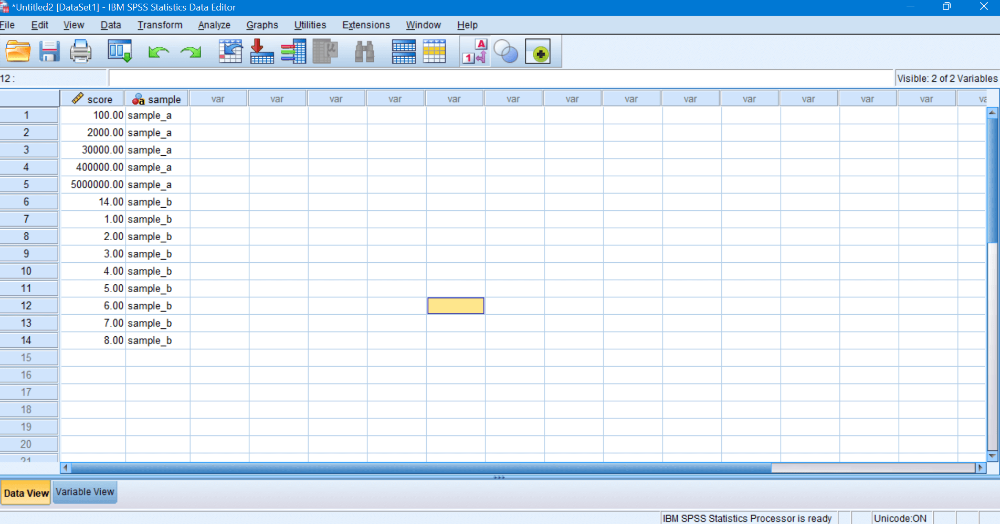
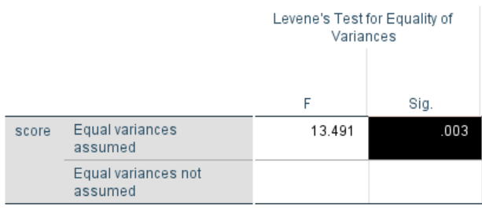
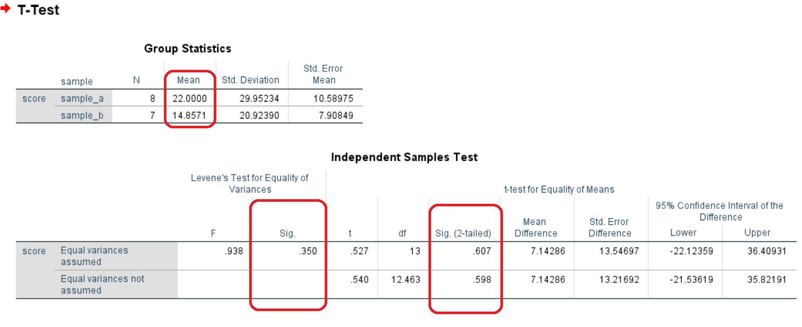
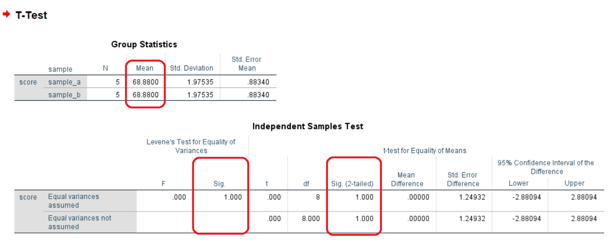
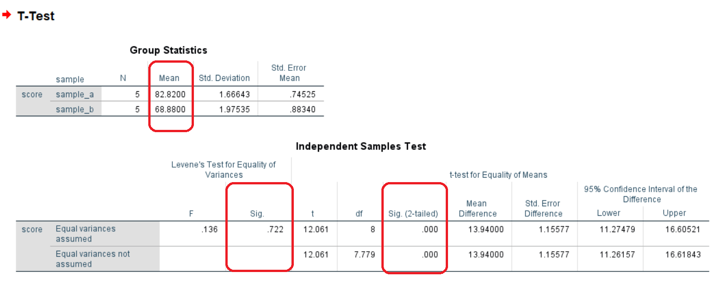

Ｔ－Ｔｅｓｔｅｒ

T-Tester is a simple and adaptable tool that runs in the terminal and can be adapted to any number of business needs and other scenarios.  
  
  
    
  
## Contents
1. [Overview](#overview)  
2. [Tech Stack](#tech-stack)  
3. [User Stories](#user-stories)
4. [Features](#features)
    + [Future Features](#future-features)
5. [Testing](#testing)
    + [Test Cases](#test-cases)
        - Invalid Input
        - Sample Datasets
6. [Issues](#issues)
7. [Deployment](#deployment)  
8. [Acknowledgements](#acknowledgements) 
  

## Overview  
As the name may suggest, the primary function of T-Tester is to carry out the statistical test known as a t-test. While there are several forms of t-test, also known as Student's t-test, perhaps the most commonly used is the independent t-test.  
  
Developed by William Sealy Gossett, publishing under the pseudonym Student, t-tests are frequently implemented to check the reliability and generalisability of an apparent difference in mean averages.  As a brief example, one might imagine a survey in which the heights of 100 people from two different regions are recorded. The mean average height from Region A is unlikely to be identical to that of Region B. However, such a difference may result from either random chance or be reflective of a real-world difference. In this scenario, the researcher's objective is to assess the reliability of this difference via statistical analysis. A difference that meets the test's criteria to be considered reliable can be referred to as a statistically significant difference.  

### Example Uses
Other examples where a t-test might be deployed include:  
- Comparing the mean average weekly (or other interval) sales within two branches of a store chain.  
- Comparing the mean average weekly (or other interval) sales of one store from two different years or quarters.  
- Comparing batches of consumable goods for consistency and quality control.  
- Quality control of any goods where mean averages can be used for assessment; for example, ensuring that each batch of household paint produced contains consistent amounts of all chemicals used in manufacturing.  
- Comparing customer satisfaction scores between agents or representatives providing services on behalf of a company.  
- Expenditure comparisons; for example, average monthly expenditure for two office branches.   
- Cost comparisons; for example, comparing the average amount billed by two different service utility providers over a given period where bills are not a fixed monthly amount.
- Time comparison, such as in comparing the average time taken to perform a given task.  
  
T-Tester then is an adaptable tool that can be deployed to almost any scenario in which a t-test may be used. Although discussed in more detail in the [Features](#features) section, T-Tester's functions, in brief, include:  

- Help menu allowing the user to access instructions for use within the program itself.  
- Gathering sample data for two samples.
- Carrying out pre-test checks:  
    + Ensuring the number of data points (subjects) in each sample is adequate for testing.
    + Testing for homogeneity of variance, an assumption of the t-test which, if not met, may mean the data is not suitable for a t-test.  
- Executing an independent t-test and outputting the result to the user in a simplified format, for example:  
    + No statistically significant difference found 
    + Statistically significant difference. The mean average of Sample A (3.44) was greater than that of Sample B (2.88).  
- Saving results to a spreadsheet alongside the time and date of the test as well as the name or organisational ID of the user conducting the test.
- Allowing the user to view previous records in a formatted table within the terminal.  
- Allowing the user to delete the last record shown within the table; for example, where a test is erroneously carried out twice.  
  
To view images of these features, see [Features](#features). To explore these features with sample data, see "Sample Datasets" in [Testing](#testing).  
  
  
## Tech Stack  
1. Languages:  
    + Python  
2. Main Libraries & Modules:  
    + [google-auth 2.6.3](https://pypi.org/project/google-auth/)
    + [gspread 5.3.0](https://pypi.org/project/gspread/)
    + [numpy 1.22.3](https://pypi.org/project/numpy/)
    + [scipy 1.8.0](https://pypi.org/project/scipy/)
    + [rich 12.2.0](https://pypi.org/project/rich/) 
    
## User Stories  
As a user, I want to...  
  
- Understand how to use the program  
    + Brief instructions on each of the program's functionalities can be easily accessed from the Main Menu. These are divided by topic, allowing the user to access the most relevant information to their situation. A link to more in-depth information, provided in this README document, is also provided.  
  
- Ascertain the suitability of my data for use in the program  
    + T-Tester checks for homogeneity of variance, an important consideration when conducting independent t-tests. T-Tester also ensures that each sample contains at least five subjects. A famously robust test in this regard, the independent t-test can accommodate small sample sizes. However, T-Tester cannot assess methodological issues such as sampling method and representativity. It does not, at the time of writing, provide information on distribution such as skewness and kurtosis.  
  
- Compute the mean averages of two samples  
    + T-Tester calculates the mean average for each sample provided but does not relay non-significant data within the terminal as this could be misleading. Instead, the mean averages are relayed within the terminal only for statistically significant results. However, a record of all means is kept within the associated Google Sheets spreadsheet, should an organisation have other uses for this information.  
  
- Compare the means of two samples, if suitable  
    + T-Tester's primary function is to carry out an independent t-test, comparing the means of two samples and determining the statistical significance of any difference identified.
  
- See the results of the analysis  
    + Results of any tests conducted (Levene's test, independent t-test) are relayed within the terminal in terms of significance.
    
        | Possible Outputs                                                                                                   |  
        |--------------------------------------------------------------------------------------------------------------------|  
        | T-test not conducted due to unequal variance. Data is unsuitable for t-test. Reason: Lacks homogeneity of variance.|  
        | No statistically significant difference found                                                                      |  
        | Statistically significant difference. The mean average of Sample A (3.44) was greater than that of Sample B (2.88).|  
  
- Read records of past test results  
    + The Main Menu provides an option to "View Records" which allows the user to view a table of past test results within the program. Records can also be viewed in the related Google Sheet. 
    
- Create a new record for each new test conducted  
    + A new record is added for each test process, recording the time and date of the test's completion, the user's name, username or ID, the mean average for each sample used within the test(s) and one of the three possible outputs in the table above.  
  
- Store records in a manner that makes them easy to share  
    + While accessible as a table within the program, records are stored in a Google Sheets spreadsheet, meaning they could be easily shared within an organisation or with other parties if desired. This also means that records are accessible on multiple devices and when the program is closed or the user does not have access to the program.  

- Update the externally-stored records automatically   
    + Newly created records are added to the connected Google Sheet rather than the program itself. This is also true when deleting data; it is the Google Sheet that is being updated. The program simply retrieves this information from the Google Sheet in order to display records in a convenient manner within the terminal. Changes to the Google Sheet are, therefore, reflected within the program, although it may be necessary to restart the program in order to see the most recent version of the available records.  
  
- Store records in a manner that allows me or others to copy, extract, manipulate or delete data  
    + Records are stored in a Google Sheet spreadsheet which not only makes their content more accessible in many ways but also means that either selected data or the entire worksheet can be copied. Individual records or fields can be extracted for use in other programs. Data can also be deleted from the spreadsheet or a copy of the spreadsheet. For instance, one colleague may need access only to statistically significant results and may wish to store these in a separate spreadsheet, file or program.  
  
- Delete a record if created in error  
  + The last shown record within the records table can be deleted by the user. This enables duplicate tests to be removed immediately upon realising the error, or in the event that a test was carried out on a dataset containing an error, it can be removed immediately. Records older than this can only be changed from within the Google Sheets spreadsheet. To minimise the risk of accidental deletion, a warning is displayed and confirmation is required. To confirm deletion, the user is instructed to type "DELETE" in capitals. Simultaneously, the user is told that pressing Enter will cancel deletion. If a request to delete a record is aborted in this manner, the user will be directed away from the deletion screen and back to the preceding menu. A lowercase response ("delete") will prompt a message informing the user that the option is case sensitive and asking them to try again.  
  
- Navigate through the program  
    + Menus allow for easy and relatively intuitive navigation. Instructions are provided alongside menus, informing the user how to make a selection. T-Tester also enables the user to return to the previous menu where relevant; for example, after cancelling the deletion of a file or after reading a help topic.  
  
- Minimise the risk of entering incorrect data  
    + Invalid data is handled through error messages, automatic re-formatting and prompts to the user; however, valid data can nevertheless be incorrect data, largely due to omission, typo or other user error.
    
    To minimise the risk of omitting a value within a sample, the user is asked to specify the number of values they expect to be entering (ie. the number of subjects within a sample), and this is compared to the actual number of values entered when the user submits the sample.  
      
    To ensure this comparison works as efficiently as possible, confirmation is required for both inputs. The following example cases explain how these checks are applied:  
      
    **Case 1: The user erroneously enters "13" as the number of subjects for a sample which actually contains 14 values.**  
    T-Tester will display the message, "You entered: 13. Is this correct? Y/N", requesting confirmation that this number is correct. As it is incorrect, the user enters "N" and is offered the opportunity to re-enter the number.  
      
    **Case 2: The user correctly inputs "14" as the number of subjects, but subsequently enters only 13 of these values due to a typo, omission or copy/paste error.**  
    T-Tester will alert the user of the disparity and restart collection of that particular sample.  
      
    **Case 3: The user enters the correct number of values for the sample, but the input contains a typo.**  
    T-Tester relays the values for a sample back to the user in a message such as, "You entered: [1, 2, 3, 4, 6]. Is this correct? Y/N".  The values shown in this message have been automatically formatted, making them easy to read and increasing the user's ability to spot any typos. For example, the data above may have originally been entered by the user as "1,,,, 2,3,  4, 6,,", but the program has formatted it in a more consistent and readable manner. If the data does contain a typo, the user will respond "N" to decline confirmation and be asked to enter the values again.

- Avoid crashing/restarting the program if I inadvertently enter incorrect input  
    + When invalid input is entered, a helpful message is displayed prompting the user to amend their input and allowing them to continue from the relevant step of the process. In most cases, this is the previous step within a given process.  
    
    Where an as yet unforeseen error arises, the program will attempt to return the user to the Main Menu. If for any reason, this fails, or where the error arises within the Main Menu, the program will close through its own quit process. T-Tester's quit process informs the user, "Sorry, something went wrong. [error message]. Quitting program..." before quitting with Python's built-in quit function. A slight delay is added between the phrases of this message to ensure the reader is not unduly alarmed and has time to take in the message. If, for any reason, the T-Teminal's quit process cannot run as intended, it will simply use the built-in Python quit function without any communication to the user. Ctrl+C/Cmd+C will terminate the program and therefore does not allow further activity or communication from the program itself.  
    
- Receive feedback in case of erroneous input  
    + Helpful and descriptive error messages and prompts are used wherever possible within the program whenever invalid data is entered. The user is then offered the opportunity to re-enter this data without needing to restart the program or even restart the testing process if using the program's testing functions.  
  
- Correct invalid or erroneous input without restarting the program  
    + As described elsewhere, a response in Y/N format is required to confirm inputs when running tests. If the user responds "N", T-Tester provides the opportunity to re-enter the input. Where invalid data is entered, the user is shown a descriptive error message and then offered the opportunity to re-enter this data without needing to restart the program.  
  
- Exit the program easily  
    + The user can exit the program from the Main Menu. In this event, the program will inform the user with a simple "Quitting program..." message. A slight delay is added between this message and exiting the program, ensuring the user has time to read the message.  
    + Ctrl+C/Cmd+C will terminate the program and therefore does not allow further activity or communication from the program itself.  
  
Individual error messages are discussed in [Test Cases](#test-cases). The [Test Cases](#test-cases) section also provides sample datasets which function as test cases for sample entry in T-Tester's testing mode.
  
## Features  
Upon launching, T-Tester greets the user with a Main Menu, presenting the options available to the user and offering instructions on how to select an option. Available options include a Help section, the ability to run statistical tests, an area in which to view records and, if desired, delete records. The final option allows the user to quit the program.  

  
    
T-Tester has a built-in help section allowing the user to access instructions for use.  

  
    
T-Tester's primary function is to carry out an independent t-test, comparing the means of two samples and determining the statistical significance of any difference identified. This function is accessible from the "Run Tests" option of the Main Menu. The user is then asked to enter a username/ID. This ID will be saved along with the results of the test process when completed. The ID may be anything the user wishes, provided it is two or more characters in length. This allows for initials to be used as an ID if desired. If the username is less than two characters in length or the user submits empty input, an error message is shown and the user is prompted to enter the information again. All error messages requiring re-entry are detailed in [Testing](#test-cases) as test cases.  
  
  
    
Next, the user is prompted to enter the number of subjects in the first sample. This must be five or more and entered as an integer value.  
  
  
    
This number will subsequently be used to verify the sample once submitted. Therefore, to ensure the number is correct, the user is prompted to confirm by typing Y or N. "N" will cause the step to be repeated, while "Y" will proceed to the next step. Lowercase input is automatically handled and will not cause an error; however, blank or otherwise empty input will require re-entry.
  
 
  
The user is asked to input the values within that sample. These can be typed or pasted in from elsewhere. To be interpreted correctly by T-Tester, the values must be separated by commas. However, duplicate commas and erroneous spaces are handled automatically by T-Tester. This means that duplicate commas will not create empty values that could trigger a disparity between the number of values entered and the number of subjects previously declared, or affect the statistical processes that follow. T-Tester will also check the number of values is greater than four. Independent t-tests are famously robust and work well with small sample sizes, and five or more may be considered a reasonable threshold.  
  
 
  
T-Tester also performs Levene's test for homogeneity of variances. This aids in ensuring that an independent t-test will be suitable for use with the data provided. If homogeneity of variance is found, T-Tester will proceed to conduct an independent t-test.  

  
    
The results of the independent t-test are then reported in terms of their significance, with means being reported alongside any significant results. The user is also informed that the connected spreadsheet has been updated with a newly created records of test results.
  
 
  
A table of past results (records) can be viewed within T-Tester, although the results are, in fact, stored in a Google Sheets spreadsheet, meaning they can be easily shared, copied, extracted for use elsewhere and so on. 

  
  
To view past records within the program, the user can select View Records from the Main Menu. This will open the records section which contains a table showing results of previous tests. Each row within this table is an individual record of a completed test process. All completed test processes are stored, regardless of outcome.  

  
  
Beneath the table, the user has the option to return to the Main Menu or delete the last record currently shown on the table. This is a permanent deletion and will also affect the Google Sheets spreadsheet. Historical edits within Google Sheets, if available, are the only means of undoing this deletion. Depending on how access to the spreadsheet is granted within an organisation, this may mean that only upper administrators have the option to selectively delete records and/or restore them. The user of the program, however, will still be able to remove their last test should they discover it used incomplete data or was already performed, for instance.  

  
  
A warning message is shown ensuring the user understands the action they are undertaking. To confirm deletion, the user must type DELETE in capital letters, after which confirmation is given and they are returned to the previous menu.  

  
  
As is appropriate for an action of this nature, cancelling the action is easier than confirming it. To cancel the action, the user may simply press Enter. Cancelling produces the output "Exiting without making changes..." to reassure the user, and after a momentary delay to allow the user to read this message, they are returned to the previous menu.  
  
The only invalid input at this time is "delete" written in lower case letters. Requiring the user to turn on CapsLock or hold Shift ensures that a moment can elapse in which they can be certain they wish to proceed with this action. This is similar to the confirmation-of-deletion process used by MailChimp, for example, where a user is required to type "PERMANENTLY DELETE" in capital letters before taking irreversible action.  

  
  

As mentioned previously, the user may quit the program from the Main Menu. This produces the output "Quitting program..." and after a delay of 1 second, the program will terminate.  

  
  

### Future Features  
It is debatable whether deletion of records beyond the last shown record is a desirable feature. Deletion of the last shown record may be useful when a user realises, shortly after conducting a test, that the test was already carried out, used an incomplete or incorrect dataset and so on. For more selective deletion of records, access to the related Google Sheets spreadsheet is required. This limitation of the program may actually represent a useful feature in and of itself, as Google Sheets' permissions and access options allow for precise control of who may carry out such selective deletion. Nevertheless, it is possible that the program may expand its deletion options in the future.  
  
Currently, the program does not assess skewness and kurtosis. These features could be added for a more rounded and thorough set of pre-test checks.  

Additional inputs could be added to the program's testing feature, such as a "Tester Notes" input. This input could then be added to an additional field in the records kept. The usefulness of such a feature may depend on how the program is being used. The optimal design would be one in which the user can configure which fields are needed within their records and which fields are unnecessary. To be truly useful, these settings would need to be stored in a lasting manner. Only the necessary inputs would then be requested during the testing process.  
  
Finally, other forms of t-test, such as the paired samples t-test, could be added.
    
## Testing  
Manual testing, including exploratory testing, was carried out throughout development. New features were tested as they were added and before committing changes. Certain features were pushed and tested within the deployed environment to ensure that rendering was as intended. [PEP8online.com](http://pep8online.com/checkresult) was frequently used during development to validate code.  
  
 
  
In the initial stages of developing the statistical portion of the program, and again during a dedicated testing phase toward the end of development, the results of the sample datasets below were verified in IBM's statistical package, [SPSS](https://en.wikipedia.org/wiki/SPSS).  
  
 
  
Additionally, to further verify results and aid the reader of this document to carry out similar tests, [SocSciStatistics.com](https://www.socscistatistics.com/tests/levene/default.aspx) was also used to confirm results given by T-Tester when checking for homogeneity of variance (Levene's Test). This is freely available online and does not require specialised software.  
  
In a similar manner, [GraphPad](https://www.graphpad.com/quickcalcs/ttest1.cfm) was used to confirm t-test results.  
  

  
### Test Cases
  
***Invalid Input***
    
Attempting to enter the following values in response to their respective input requests shows an error message and prompts the user to correct the error by trying again.  
  
**Menus**
| Request                | Invalid Value Type               | Error Message                                                   |  
|------------------------|----------------------------------|-----------------------------------------------------------------| 
| Main Menu Selection    | Blank                            | Invalid Selection. Please enter a number from the options shown.|
| Main Menu Selection    | Letter/symbol(s)                 | Invalid Selection. Please enter a number from the options shown.|  
| Main Menu Selection    | Number out of option range       | Invalid Selection. Please enter a number from the options shown.|
| Help Menu Selection    | Blank                            | Invalid Selection. Please enter a number from the options shown.|  
| Main Menu Selection    | Letter/symbol(s)                 | Invalid Selection. Please enter a number from the options shown.|  
| Main Menu Selection    | Number out of option range       | Invalid Selection. Please enter a number from the options shown.|  
| Records Menu Selection | Blank                            | Invalid Selection. Please enter a number from the options shown.|  
| Records Menu Selection | Letter(s)/Symbol(s)              | Invalid Selection. Please enter a number from the options shown.|  
| Records Menu Selection | Number out of option range       | Invalid Selection. Please enter a number from the options shown.|  
  
 
  

**Running Tests**
| Request  | Invalid Value Type               | Error Message                                                              |  
|----------|----------------------------------|----------------------------------------------------------------------------| 
| Username | Blank                            | Username or ID required (e.g. SamBeckett, User1, etc.)                     |  
| Username | Single character                 | Username must be at least 2 characters in length                           |  
| Subjects | Blank                            | Enter an integer, e.g. '7' (Not '7.2' or 'seven'). Please try again.       |  
| Subjects | Letter(s)                        | Enter an integer, e.g. '7' (Not '7.2' or 'seven'). Please try again.       |  
| Subjects | Number below 5                   | Five or more subjects required. Try Again.                                 |  
| Subjects | Negative number                  | Five or more subjects required. Try Again.                                 |  
| Subjects | Float, e.g. 5.2                  | Enter an integer, e.g. '7' (Not '7.2' or 'seven'). Please try again.       |  
| Y/N      | Blank                            | Press Y if correct, or press N to re-enter the data.                       |  
| Y/N      | Letter other than Y/N*           | Press Y if correct, or press N to re-enter the data.                       |  
| Y/N      | Number                           | Press Y if correct, or press N to re-enter the data.                       |   
| Sample   | Blank**                          | 0 values entered. Expected [subjects]. Please begin this sample again.     |    
| Sample   | Comma(s) only**                  | 0 values entered. Expected [subjects]. Please begin this sample again.     |  
| Sample   | Number of values != [subjects]   | [x] values entered. Expected [subjects]. Please begin this sample again.   |    
| Sample   | Letter(s), e.g. "G", "1,2,3,r,5" | Non-numeric value(s) detected. Try again.                                  |  
| Sample   | Punctuation, other than as float | Non-numeric value(s) detected. Try again.                                  |  
| Sample   | Multiple decimals e.g. "5..2"    | Non-numeric value(s) detected. Try again.                                  |  
| Y        | Any other letter                 | No other operations available at this time. Press Y to return to Main Menu.|  

*Note that a lowercase y/n is handled automatically and does not require user intervention.  
** Note that multiple commas or spaces within an otherwise valid sample (1  ,2, , 3 , 4,,,5) are automatically corrected.  
  
  
**Deleting Records**
| Request                               | Invalid Value Type| Error Message                                |  
|---------------------------------------|-------------------|----------------------------------------------| 
| "DELETE" or                           | "delete"          | "This option is case-sensitive.              |  
|  Enter to cancel or                   |                   | To delete, type 'DELETE'                     |
|  any key followed by Enter to cancel  |                   | To exit, press any other key and hit Enter." |

  
  
  
***Sample Datasets***  
   
The following sample datasets can be used to test different outcomes of T-Tester's testing mode. In addition to a great deal of fictional data improvised during testing, these datasets have been used as test cases for the various statistical outcomes possible within T-Tester.    
    
  
**How to Use Sample Datasets:**  
Keeping this README document open for reference, [launch the program](https://t-tester.herokuapp.com/). Select "Run Tests" from the menu by pressing the associated number in the menu (e.g. 2) on your keyboard. When entering input, you must then use the Enter key on your keyboard to submit your input.  
  
You will be asked to enter a username or ID of your choosing. This must be two or more characters in length. Type your chosen username and again press Enter.  
  
When prompted, enter the number of subjects in the first sample of your chosen dataset. This must be entered as an integer (ie. "5", not "five" or "5.0"). After pressing enter, you will be asked to confirm by submitting either Y or N.  

You will now be asked to input the values within the sample. You may type these individually or simply copy-and-paste the values from the dataset below. Submit the information by pressing Enter and confirm. You will be prompted to repeat the relevant steps for the second sample.  The program will proceed according to the outcome described for each sample dataset.  
  
To verify results, using the resources given in each outcome description, the following resources are available at the time of writing:  
- [SocSciStatistics.com](https://www.socscistatistics.com/tests/levene/default.aspx)
        

        How to Use This Resource
        

        Navigate to the site and, as per the instructions given on-screen, enter the values for Sample A of your chosen dataset into the area labelled "Sample 1 (a)". These can be typed manually or copied and pasted but must be formatted either as a comma-separated list or with one-value-per-line. Repeat for Sample B in the appropriate area and click the "Calculate" button at the bottom of the screen. The information needed to verify T-Tester's result will be output in red text at the bottom of the screen. Where homogeneity of variance is not found, it will read "The requirement of homogeneity is not met". Otherwise, it will read "The requirement of homogeneity is met."  
        
  
- [GraphPad](https://www.graphpad.com/quickcalcs/ttest1.cfm)
        

        How to Use This Resource
        
 
        Having navigated to the site, the user will see four numbered boxes. In box 1, select the second option ("Enter or paste up to 2000 rows"). In box 2, the correct selection for this test is "Unpaired t test", another name for independent t-test. In box 3, enter the values for Sample A in the first column, one value per row. Repeat for Sample B in the second column. In box 4, click "Calculate Now." The information needed to verify T-Tester's result will be output near the top of the page and phrased in terms of significance. For example, "By conventional criteria, this difference is considered to be not statistically significant". Be sure to start again from scratch with each test so as to avoid errors.
        
  
  
**Test 1: Unsuitable Data**
| Dataset 1| Subjects |  Values                               |
|----------|----------|---------------------------------------|
| Sample A |     6    |  100,2000,30000,400000,5000000,14     |
| Sample B |     8    |  1,2,3,4,5,6,7,8                      |  
  
>**Outcome 1: Data Unsuitable**  
>In Dataset 1, the two samples collected from the user are unsuitable for an independent t-test and will fail when the program checks for homogeneity of variances (Levene's Test), causing the program to bypass the t-test. This can be verified by inputting the same numbers to an online Levene's Test tool, such as [SocSciStatistics.com](https://www.socscistatistics.com/tests/levene/default.aspx) which will output "The requirement of homogeneity is not met".  
>  
> As with all test cases here, and a good deal of improvised data during development, these results were verified with IBM's SPSS. In this case, SPSS found a significant result for Levene's test, meaning the null hypotheis (equal variance) was rejected. This is in agreement with T-Tester's output.  
>  
> 
>  
>  
 

**Test 2: Non-significance**  
  
| Dataset 2| Subjects |  Values             | Mean  |
|----------|----------|---------------------|-------|
| Sample A |     8    |  3,5,21,7,3,5,87,45 | 22.00 |  
| Sample B |     7    |  8,7,3,9,5,62,10    | 14.86 |  
  
  >**Outcome 2: No Statistically Significant Difference**  
  In Dataset 2, the samples are considered suitable for an independent t-test and the program will proceed to carry it out. Again, this can be verified by inputting the same numbers to [SocSciStatistics.com](https://www.socscistatistics.com/tests/levene/default.aspx) which will output "The requirement of homogeneity is met".  
  >  
  >Once carried out, the independent t-test will return no statistically significant difference between the samples in this dataset. This can be verified using an online t-test calculator, such as that available from [GraphPad](https://www.graphpad.com/quickcalcs/ttest1.cfm) which will output "By conventional criteria, this difference is considered to be not statistically significant."  
  >  
  >As an additional test, compare the values given by GraphPad for each group's Mean at the bottom of the screen to those stored in the Google Sheets spreadsheet. In this case, both record 22.00 for Sample A and 14.86 for Sample B.  
  >This result is confirmed by SPSS as shown in the image below. To begin with, the means are in agreement, although SPSS does not round to the same number of decimal places. A non-significant result (p = > .05) for Levene's test confirms homogeneity of variances. And finally, a non-significant result is shown for the independent t-test.  
  >  
  > 
  >To avoid misleading the user, T-Tester does not output means for non-significant results to the terminal; however, they are preserved in the spreadsheet which is shown at the end of this section.  
  >  
  

**Test 3: Identical Data (Non-Significance)**  
  
| Dataset 3 | Subjects |  Values                       | Mean  | Outcome          |
|-----------|----------|-------------------------------|-------|------------------|
| Sample A  |     5    |  66.1, 69.9, 67.7, 69.6, 71.1 | 68.88 | Non-significant  |
| Sample B  |     5    |  66.1, 69.9, 67.7, 69.6, 71.1 | 68.88 | Non-significant  | 
  
  >**Outcome 3: No Statistically Significant Difference**  
  >In Dataset 3, the values entered are identical. Homogeneity of variances is therefore confirmed and the test will proceed. The mean average returned for each sample is identical and no statistically significant difference is found.  
  >  
  >[SocSciStatistics.com](https://www.socscistatistics.com/tests/levene/default.aspx) output: "The requirement of homogeneity is met."
  >
  >[GraphPad](https://www.graphpad.com/quickcalcs/ttest1.cfm) output: "By conventional criteria, this difference is considered to be not statistically significant."  

  >As before, this result is confirmed by SPSS as shown in the image below. Identical means are given, homogeneity of variances is confirmed (naturally, since the samples are identical), and no significant difference is found.  
  >  
  > 
  >To avoid misleading the user, T-Tester does not output means for non-significant results to the terminal; however, they are preserved in the spreadsheet which is shown at the end of this section.  
  >  
  

**Test 4: Significance**  
  
| Dataset 4 | Subjects |  Values                            | Mean  | Outcome     |
|-----------|----------|------------------------------------|-------|-------------|
| Sample A  |     5    |  83.70, 81.50, 80.60, 83.90, 84.40 | 82.82 | Significant |
| Sample B  |     5    |  66.1, 69.9, 67.7, 69.6, 71.1      | 68.88 | Significant | 

>**Outcome 4: Statistically Significant Difference**  
>In Dataset 4, homogeneity of variances is confirmed, the mean average of each group is calculated, and an independent t-test is carried out. A statistically significant difference is found, with the mean of Sample A being greater than that of Sample B.    
>  
>T-Tester output: Statistically significant difference. The mean average of Sample A (82.82) was greater than Sample B (68.88).  
>[SocSciStatistics.com](https://www.socscistatistics.com/tests/levene/default.aspx) output: "The requirement of homogeneity is met."
>
>[GraphPad](https://www.graphpad.com/quickcalcs/ttest1.cfm) output: "By conventional criteria, this difference is considered to be extremely statistically significant."  Mean averages for Sample A and Sample B are 82.82 and 68.88 respectively.  
>  
>This result is confirmed by SPSS. To begin with, the means are in agreement with T-Tester's result, and a non-significant result is reported for Levene's test, meaning the null hypothesis cannot be rejected and equal variances can be assumed. A significant result is reported for the independent t-test, meaning a statistically significant difference can be said to exist between these samples.  
>  
> 
>  
 
  
**Summary of T-Tester Results**
  
  

  
    
## Issues
Various fixes were applied during development as small issues arose; however, one issue of particular interest applies to the code block below. When the user is prompted to input the number of subjects in a particular sample, this input is passed to a validation function which must establish that the input:  
+ is not blank  
+ is not stated as a negative number  
+ is not a decimal number that cannot be resolved into an integer, e.g. "7.2"   
+ is not a string that cannot be resolved into an integer, eg. "five" or "g"  
+ is not less than 5  
  
Function code is shown below. Note that `error_dict` contains error messages that can be reused throughout the project. For example, `{error_dict['blank_input']}` retrieves the error message relevant to blank data. This structure is to allow for re-use of recurring messages but also to facilitate reuse in the case of future scaling.
  
    `if qty == "":  
        raise TypeError(f"{error_dict['blank_input']}")  
    if "-" in qty:  
        raise ValueError(f"{error_dict['negative_number']}") 
    try:  
        float_qty = float(qty)  
    except Exception:  
        pass  
    else:  
        if float_qty % 1 != 0:  
            raise ValueError(f"{error_dict['subject_int']}")  
    if not qty.isdigit():  
        raise TypeError(f"{error_dict['non_numeric_detected']}")  
    qty = int(qty)  
    if qty < 5:  
        raise ValueError(f"{error_dict['subject_qty']}")`  
  
Achieving the desired result required a good deal of trial and error with various methods. While numbers such as "2.3" were caught by the `non-numberic_detected` error check, the goal was to provide a more specific message to the user. The sequencing of the solution above requires consideration of the variable's type at each stage of the code.   
  
    `  # Variable (qty) begins as string input
    if qty == "":  
        # If this string is empty, raise error re. blank input.
        raise TypeError(f"{error_dict['blank_input']}")  
    if "-" in qty:  
        # If minus sign or hypen appears in string, raise error re. negative numbers.
        raise ValueError(f"{error_dict['negative_number']}")
    try:  
        # Try to cast qty as float and assign result to new variable.
        float_qty = float(qty)  
    except Exception:  
        # If qty cannot be cast as float, do nothing. This prevents creating an unwarranted error which may hide the true error, if any.
        pass  
    else:  
        # If qty can be cast as float (e.g. "5.5" or "5.0"), discover whether this value can be cast as an integer with ease (e.g. "5.0")
        # by checking whether there is a remainder when divided by 1. A whole number such as 5.0 will leave no remainder.
        if float_qty % 1 != 0:
            # If there is a remainder, raise an error informing the user that only whole numbers may be entered.  
            raise ValueError(f"{error_dict['subject_int']}")  
    if not qty.isdigit(): 
        # The variable qty is still a string at this point. A float version, if created, was assigned to a new variable.
        # Python's isdigit() method ascertains whether the string is a digit in string format, e.g. "42".
        # If qty is not identifiable as a digit, raise an error re. non-numerical values.
        raise TypeError(f"{error_dict['non_numeric_detected']}")  
    qty = int(qty)
    # Convert qty to an integer.  
    if qty < 5: 
    # If the value of the integer qty is less than 5, raise an error informing the user that 5 or more values will be required. 
        raise ValueError(f"{error_dict['subject_qty']}")`
  
This code block is an extract from a function that returns False if any of the errors above are raised. That function is called within a loop. If the function returns False, the user is returned to the relevant input to re-enter their data. If the function returns True, the user may proceed to the next stage of the program.  
  
  
## Deployment  

Click to Expand: Deployment Procedure

   
  
### Heroku  
The site was deployed to Heroku using the following procedure. Before beginning, ensure that requirements.txt is up to date.    
1. An account must first be created on [Heroku.com](https://www.heroku.com/)  
2. Once logged in, select "Create new app".  
3. The app must then be given a unique name and the developer's region must be selected from a list of options.  
4. From the Settings tab of the next screen, select "Reveal config vars".  
5. The file creds.json, which is not included in the associated git repository, was added as a config var.  
    + Key = "CREDS", Value = Contents of the associated CREDS.json file.
    + A PORT key was also added with the value of 8000.
6. Click "Add Buildpack" and add both Python and, in order to use the mock terminal provided by CodeInstitute for this particular project, Node.js, in that order.
7. Within the deploy section, select GitHub as the deployment method and authorise.
8. Input the name of the GitHub repository and click "Search", followed by "Connect".  
9. Choose either "Automatic deploys" or "Manual deploy". In this case, the developer opted for manual deploy for the initial deployment and, having verified that deployment was successful, enabled automatic deploys thereafter.  
10. Select the appropriate branch from which to deploy (in this case, the project had only the Main branch at the time of deployment).

### Forking & Cloning Repositories  
Forking a repository allows one to make a copy with which to experiment without affecting or jeopardising the original. This does not require any special permissions from or direct contact with the original developer provided the repository in question is public rather than private. You may wish to do this either to experiment with and learn from another party's code or aid in improving an open-source project by offering changes (note that forking is distinct from [branching](https://docs.github.com/en/pull-requests/collaborating-with-pull-requests/proposing-changes-to-your-work-with-pull-requests/about-branches)). To do this, one must have a GitHub account and be logged in. Then, simply visit the main page of the repository in question, and select the "Fork" option located in the upper-right corner (desktop) as shown in the image below. [Learn more about forks from GitHub Docs](https://docs.github.com/en/get-started/quickstart/fork-a-repo#forking-a-repository).  
 
  
Forking a repository does not create locally-stored copies of its files on your computer. To achieve this, you will also need to Clone the repository. For example, you may wish to do this if you wish to have a functioning copy of another party's code in under to compile and execute it locally. Cloning options are found under the "Code" drop-down button of a repository's main page, as shown in the image below. [Learn more about cloning from GitHub Docs](https://docs.github.com/en/get-started/quickstart/fork-a-repo#cloning-your-forked-repository).  
  
  

  
  
  
## Acknowledgements 
1. Levene's Test as carried out in Python is covered in this [Statology Article](https://www.statology.org/levenes-test-python/).  
2. Independent t-tests are covered in this [Data Camp video](https://www.youtube.com/watch?v=YpZlT64kFGA).  
3. The Main Menu function is partly based on that designed within this [How To Create a Menu in Python video](https://www.youtube.com/watch?v=P6azEyNIQDQ), with particular reference to the use of [sleep function](https://www.programiz.com/python-programming/time/sleep).  
4. ASCII-Art was generated via [fsymbols.com](https://fsymbols.com/text-art/).  
5. [SocSciStatistics.com](https://www.socscistatistics.com/tests/levene/default.aspx) was used during testing to verify results.
6. [GraphPad](https://www.graphpad.com/quickcalcs/ttest1.cfm) was also used during testing to the same end.  
7. IBM's statistical package, [SPSS](https://en.wikipedia.org/wiki/SPSS), was used to verify results of test cases and during development.
  
  